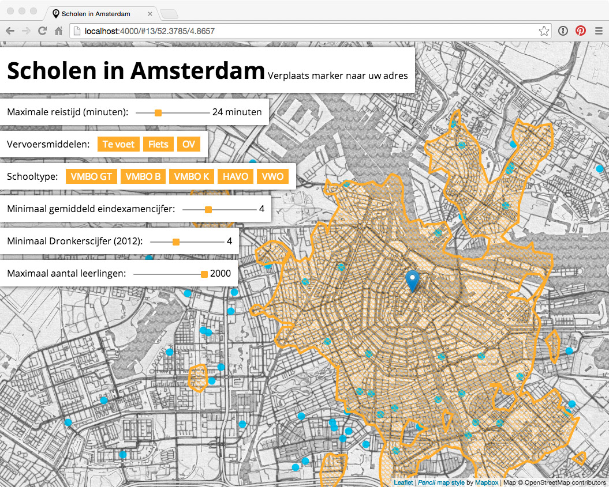

# Reachability of schools in Amsterdam

First version of [Jekyll](http://jekyllrb.com/) + [Leaflet](http://leafletjs.com/) site, which computes and shows reachability of schools in Amsterdam using [OpenTripPlanner Analyst](http://www.opentripplanner.org/analyst/). A later version will use dynamic data from a [CitySDK LD API](https://github.com/waagsociety/citysdk-ld) endpoint to load school data.

The site can be used to answer the following question:

> Which schools in Amsterdam are within 20 minutes of bike and public transport travel from my home?



## Serve site using Jekyll or GitHub pages

You can fork this repository, the website will be automatically hosted by [GitHub Pages](https://pages.github.com/) on <b>http://<i>username</i>.github.io/schools</b>. Or, clone/download this repository, and serve the site using Jekyll:

```sh
jekyll serve --baseurl ''
```

## OpenTripPlanner

__This project requires that you have a server running with the latest version of OpenTripPlanner.__

Download the [latest OpenTripPlanner JAR](http://dev.opentripplanner.org/jars/otp-latest-master.jar) to the [`otp`](otp) directory:

```sh
wget http://dev.opentripplanner.org/jars/otp-latest-master.jar -P otp
```

OpenTripPlanner needs OpenStreetMap road network data and GTFS public transport schedules to do its routing and analysis, and expects them to be in the ['otp/data'](otp/data) directory.

__Note: the bigger the GTFS and OSM files are, the more memory OpenTripPlanner needs. Please start with city-size source files! (Or buy lots of memory.)__

This website needs just data for the Amsterdam metropolitan area:

| Type          | File                                                                                                              | Source                   |
| ------------- | ----------------------------------------------------------------------------------------------------------------- | ------------------------ |
| OpenStreetMap | [amsterdam_netherlands.osm.pbf](https://s3.amazonaws.com/metro-extracts.mapzen.com/amsterdam_netherlands.osm.pbf) | [OSM Metro Extracts](https://mapzen.com/metro-extracts/)
| GTFS          | [gtfs-iffns-latest.zip](http://gtfs.ovapi.nl/ns/gtfs-iffns-latest.zip) (NS)                                 | [OVapi](http://gtfs.ovapi.nl/) |
| GTFS          | [gtfs-kv1connexxion-latest.zip](http://gtfs.ovapi.nl/connexxion/gtfs-kv1connexxion-latest.zip) (Connexxion) | [OVapi](http://gtfs.ovapi.nl/) |
| GTFS          | [gtfs-kv1ebs-latest.zip](http://gtfs.ovapi.nl/ebs/gtfs-kv1ebs-latest.zip) (EBS)                             | [OVapi](http://gtfs.ovapi.nl/) |
| GTFS          | [gtfs-kv1gvb-latest.zip](http://gtfs.ovapi.nl/gvb/gtfs-kv1gvb-latest.zip) (GVB)                             | [OVapi](http://gtfs.ovapi.nl/) |

You can download all the files needed for this project by running:

```sh
wget https://s3.amazonaws.com/metro-extracts.mapzen.com/amsterdam_netherlands.osm.pbf -P otp/data
wget http://gtfs.ovapi.nl/ns/gtfs-iffns-latest.zip -P otp/data
wget http://gtfs.ovapi.nl/connexxion/gtfs-kv1connexxion-latest.zip -P otp/data
wget http://gtfs.ovapi.nl/ebs/gtfs-kv1ebs-latest.zip -P otp/data
wget http://gtfs.ovapi.nl/gvb/gtfs-kv1gvb-latest.zip -P otp/data
```

Build the OpenTripPlanner graph:

```sh
java -Xmx4G -jar otp/otp-latest-master.jar --build ./otp/data
```

Run OpenTripPlanner server:

```sh
java -Xmx4G -jar otp/otp-latest-master.jar --server --graphs ./otp/data --analyst --pointSet ./otp/pointsets
```

Afterwards, OpenTripPlanner should be available on [http://localhost:8080/index.html](http://localhost:8080/index.html).

The `--pointSet ./otp/pointsets` argument loads the [Amsterdam schools pointset](otp/pointsets/schools.geo.json) into OpenTripPlanner Analyst. You can see if OTP loads the file correctly by checking the URL http://localhost:8080/otp/pointsets/schools.geo.

## Configuration

You can configure this project by editing the YAML files in the [`_data`](_data) directory. [`otpa.yml`](_data/otpa.yml) contains the OpenTripPlanner endpoint configuration, which is by default expected to run on `localhost:8080`.
